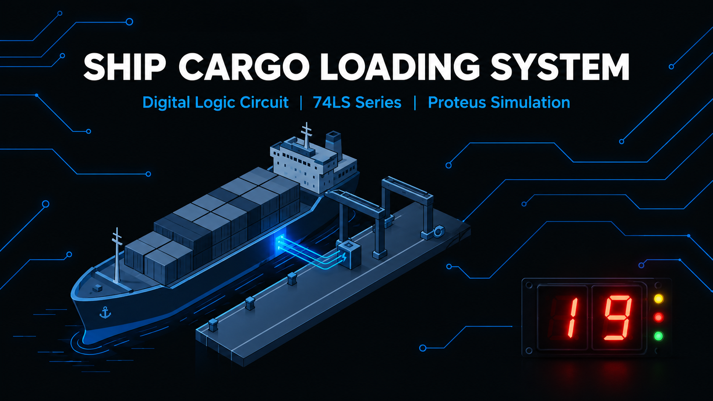

# Ship Cargo Loading System

CSE 4206 — Digital Logic Design Lab | IUT Summer 2024-2025 | Proteus 8 Professional | 74LS TTL



Single-dock port cargo pipeline. 4-bit cargo `0-15` accumulates in a synchronous register, compares against a capacity threshold, drives tri-LED status + dual 7-seg dock display `0-19` + departure counter `0-9`. Full-ship `A=B` auto-increments departures and clears the dock.

Team: MD. Sadman Saif Zarif `240041221`, Ayesha Chowdhury Aronti `240041243`, Sanjid Ahsan `240041249`.

Video: https://youtu.be/494xMRGCugs
Report: `docs/final-report.pdf`

## How it works — 5 phases

1. **Input validation:** `SW0-3` -> `U1:A/B/C 74LS32` OR-tree. Zero = reject. Non-zero + enable -> `U2:A 74LS08` -> `U8:A 74LS04` -> active-LOW `PL` on `U6`.
2. **Accumulator loop:** `U7 74LS283` adds `SW + Q0-3`, loads into `U6 74LS193`. `R1 10k` pull-up on `PL` prevents SPICE spurious load.
3. **BCD display:** `(Q3·Q2)+(Q3·Q1)` detect via `U2:B/C + U1:D`, `U5 74LS283 +6`, `U3 Tens + U4 Units 74LS47` to common-anode.
4. **Comparator:** `U9 74LS85, A=Q0-3 vs B=B0-3, Pin3=VCC, Pins2,4=GND`. `Yellow A<B / Red A>B / Green A=B`.
5. **Departure + reset:** `QA=B -> U10 CKA 74LS90 + Green LED + U6 MR`. `U11 74LS47` shows count.

See `docs/final-report.pdf` and `docs/demo-guide.md` for full details.

## Hardware

```
hardware/ship-cargo-loading-system.pdsprj
hardware/screenshots/full-schematic.png   # full circuit, converted from BMP
hardware/screenshots/01-input-validation.png
hardware/screenshots/02-accumulator.png
hardware/screenshots/03-bcd-display.png
hardware/screenshots/04-comparator-counter.png
```

Open `.pdsprj` in Proteus 8 Professional. Set capacity `B0-3`, pulse cargo `SW0-3`. No clock needed for final build — combinational + PL/MR only.

ICs: `U1 74LS32, U2 74LS08, U3/U4/U11 74LS47, U5/U7 74LS283, U6 74LS193, U8 74LS04, U9 74LS85, U10 74LS90`.

## Demo

1. Capacity `1000` (8). Cargo `0011` (3) -> dock `03`, Yellow, count `0`.
2. Cargo `0101` (5) -> `3+5=8`, Green `A=B` -> count `1`, dock auto-clears to `00`.
3. Cargo `0101` twice -> `05` then `10`, BCD shows `10`, Red `A>B`.
4. Threshold to `1010` (10) -> Green, count `2`, dock clears.

Per-member scripts: `docs/demo-guide.md`.

## Repo contents

```
README.md
docs/final-report.pdf
docs/demo-guide.md
hardware/ship-cargo-loading-system.pdsprj
hardware/screenshots/
assets/cover.png
```

Source: final submission only. Superseded FSM/storm dual-dock design and course admin PDFs excluded. Changes from proposal documented in report §5.
